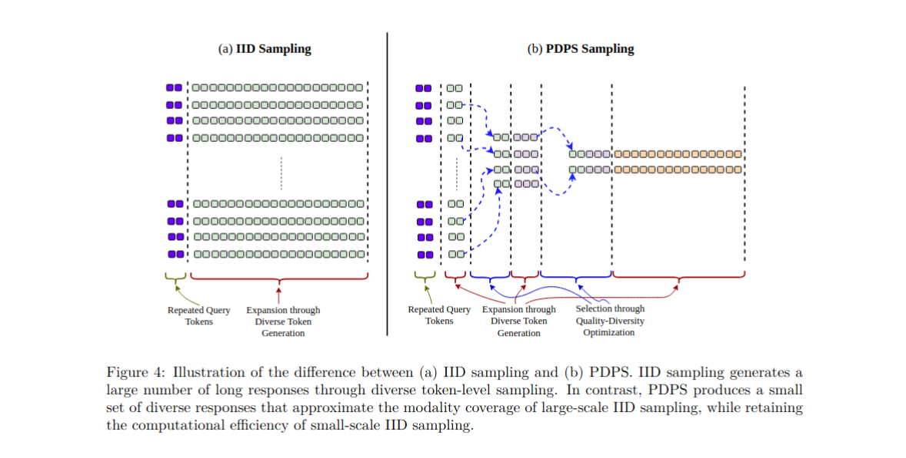

# Exposing Long-Tail Safety Failures in Large Language Models through Efficient Diverse Response Sampling

Accepted by <b>Transactions on Machine Learning Research (TMLR)</b>


Reviewed on OpenReview: https://openreview.net/forum?id=tHfAskovWI





## Setup

Install all dependencies using the following command:

```bash
$ pip install -r requirements.txt
```

**Note**: Use transformers==4.55.4 for **Diverse Beam Search**.

## Instructions

1. pdps_attack.py : It initiates the Progressive Diverse Population Sampling (PDPS). Use, 

```bash
CUDA_VISIBLE_DEVICES=0 python3 pdps_attack.py --model qwen7b_inst --dataset A --task_id 0 --temperature 1.0 --top_p 1.0 --hyp_lambda 64.0 --result_path './pdps_outcomes'
```

**Arguments:**

| Flag | Type | Required | Default | Description |
|------|------|:--------:|:-------:|-------------|
| `--model` | str | ✅ | — | Model name |
| `--dataset` | str | ✅ | — | Dataset to use. Choices: `A`, `H`, `J`, `M` |
| `--task_id` | int | ✅ | — | Task index |
| `--hyp_lambda` | float | ✅ | `64.0` | Diversity weight (λ) |
| `--result_path` | str | ✅ | — | File path to save the results |
| `--top_k` | int | | `None` | Top-k sampling value |
| `--top_p` | float | | `1.0` | Nucleus (top-p) sampling threshold |
| `--temperature` | float | | `1.0` | Sampling temperature |
| `--kv_cache_save_stage` | int | | `2` | Expansion stage from which KV-cache is maintained (see note) |
| `--seed_id` | int | | `42` | Random seed |

> **Note on `--kv_cache_save_stage`:** It controls the expansion stage at which partial generations begin being stored in the KV-cache. For example, with a value of `2`, partial responses from the first two expansion stages are *not* cached; caching begins from the third expansion stage onward.


